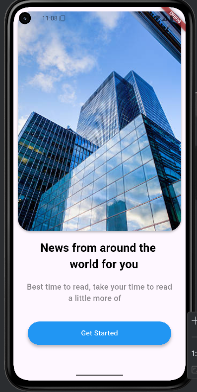
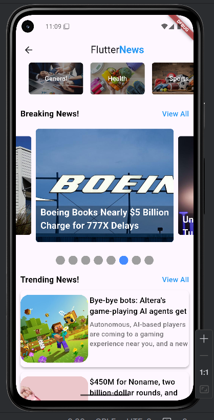
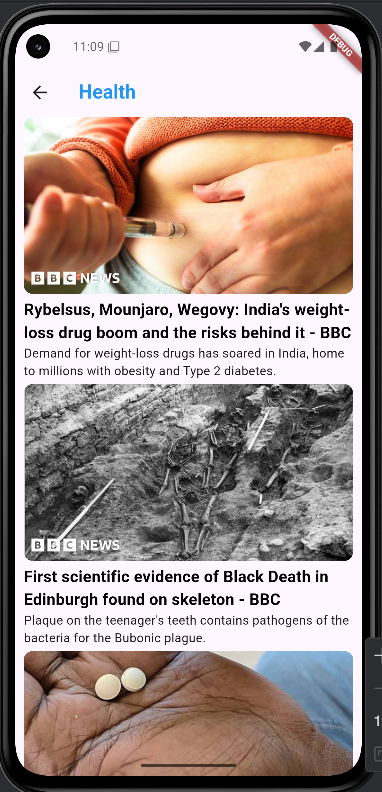
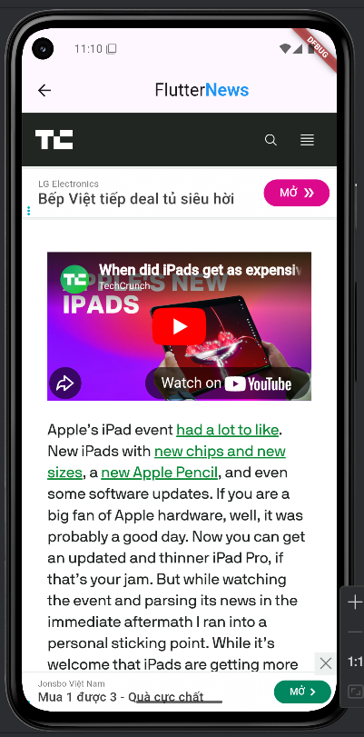

# 📌 NGUYỄN PHƯỚC THỌ - FlutterProgramming

## 📌 Giới thiệu
Đây là kho lưu trữ chứa các dự án được viết bằng framework Flutter

### App News Reader 
- 📂 [Xem mã nguồn](./news_app_project/lib/)
- Các chức năng:
- Hiển thị danh sách tin tức từ NewsAPI.org
- Xem chi tiết bài báo
- Phân loại tin theo chuyên mục (Entertainment, Sport, Health, General, Business)
- Hình ảnh minh họa:

  
  
  
  
  